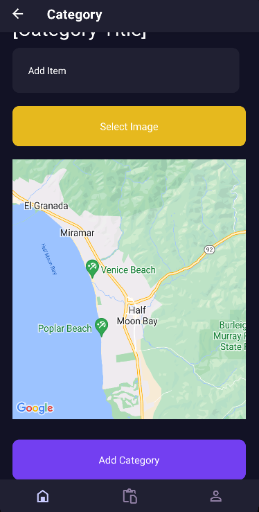

# Inventory-Tracker Mobile App

Inventory-Tracker with:

- UI: **_React Native_**
- DB: **_Sqlite_**

### Project Showcase

[](video/showcase.mp4)

### How to Locally Run the Project

Navigate to the directory to install dependencies and run the app

```
npm install
```

```
npm start
```

You can use android studio to run the app.

### DB Usage

```
    Title TEXT NOT NULL, # Used for Category state
    Name TEXT, # Used for Inventory state
    ImageUri TEXT, # Used for Inventory state
    LAT REAL, # Used for Inventory state
    LNG REAL # Used for Inventory state
```

### License

This project is licensed under the MIT License - see the [LICENSE](LICENSE) file for details.
